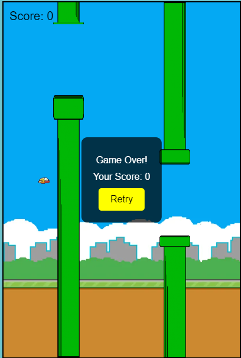

# Flippy Bird Game

A simple Flippy Bird game built with HTML, CSS, and JavaScript. This project replicates the popular Flappy Bird game with smooth animations and a retry feature.

## Demo

## Features

- Smooth bird animation
- Dynamic pipes with random heights
- Score tracking
- Game over screen with a retry button

## Installation

1. Clone the repository or download the zip file.
2. Ensure you have the following image assets in the project directory:
   - `background.png`: Background image for the game.
   - `bird.png`: Bird sprite.
   - `pipeTop.png`: Image for the top part of the pipe.
   - `pipeBottom.png`: Image for the bottom part of the pipe.

## Usage

1. Open `index.html` in your favorite web browser.
2. Press any key to make the bird flap.
3. Avoid the pipes and keep the bird in the air.
4. When the game is over, click the retry button to start again.

## File Structure

